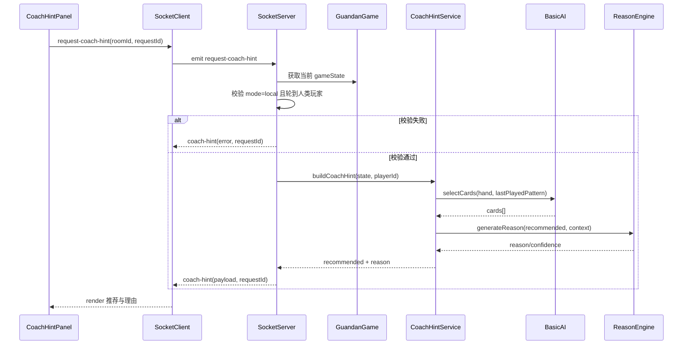

# 惯蛋教练 V1 概要设计（HLD）

## 1. 文档目标
基于 PRD 第一个里程碑（V1：人机惯蛋 + 惯蛋教练），给出可直接进入研发拆解的概要设计，覆盖：
- 系统边界与架构分层
- 模块职责
- 核心时序与数据模型
- 接口协议（Socket）
- 关键流程与兜底策略
- 非功能要求与测试策略

> 范围约束：仅支持 `mode=local`（本地人机对战）的教练提示。`mode=online` 不提供教练能力。

## 2. 范围与边界
### 2.1 In Scope（V1）
1. 本地人机对战可正常进行（沿用现有逻辑）。
2. 玩家轮到出牌时可点击“教练提示”。
3. 服务端返回：
   - `recommended`（建议出牌或 pass）
   - `reason`（策略理由）
4. LLM 不可用时，返回规则模板兜底解释。

### 2.2 Out of Scope（不在 V1）
1. 复盘回溯与单步解析（V2）。
2. 人人对战教练提示（V3 后再评估）。
3. 话术教练、身份识别策略（后续扩展）。

## 3. 总体架构
```mermaid
flowchart LR
  subgraph client [Client(Vue3)]
    gameView[GameView]
    gameBoard[GameBoard/HandCards]
    socketClient[useSocket]
    coachPanel[CoachHintPanel]
  end

  subgraph server [Server(Node+Socket.io)]
    socketHandler[SocketEventHandler]
    gameEngine[GuandanGame]
    coachService[CoachHintService]
    basicAI[BasicAI]
    reasonEngine[ReasonEngine]
    llmAdapter[LLMAdapter]
  end

  gameView --> gameBoard
  gameBoard --> coachPanel
  coachPanel --> socketClient
  socketClient --> socketHandler
  socketHandler --> gameEngine
  socketHandler --> coachService
  coachService --> basicAI
  coachService --> reasonEngine
  reasonEngine --> llmAdapter
```

## 4. 模块设计
## 4.1 Client 模块
1. `CoachHintPanel`（新增）
   - 职责：按钮交互、加载态、推荐牌展示、理由展示、错误提示。
   - 输入：当前 `gameState`、`mode`、`isMyTurn`、`myPlayer.isAI`。
   - 输出：触发 `request-coach-hint`。

2. `useSocket`（扩展）
   - 新增订阅：`coach-hint`。
   - 新增发送：`request-coach-hint`。
   - 请求匹配：使用 `requestId` 防止并发请求响应串线。

3. `game store`（扩展）
   - 新增 `coachHintState`：
     - `loading`
     - `requestId`
     - `recommended`
     - `reason`
     - `error`

## 4.2 Server 模块
1. `SocketEventHandler`（扩展 `server/src/socket/index.ts`）
   - 新增事件：
     - `request-coach-hint`（入）
     - `coach-hint`（出）
   - 模式校验：只允许 `mode=local`。

2. `CoachHintService`（新增）
   - 输入：玩家手牌、`lastPlayedPattern`、`playedCards`、当前玩家信息。
   - 输出：`recommended + reason + confidence`。
   - 过程：
     1. 调用 `BasicAI.selectCards(...)` 生成建议。
     2. 规范化为 `play|pass` 结构。
     3. 调用 `ReasonEngine` 生成理由。
     4. 失败则 fallback 模板。

3. `ReasonEngine`（新增）
   - 优先：LLM 生成自然语言理由。
   - 失败：规则模板解释（例如“无法稳定压制，建议保留高价值牌型”）。

4. `LLMAdapter`（新增/复用）
   - 复用现有 `LLMController` 的 provider 配置方式（OpenAI/Anthropic）。
   - 输出 JSON 解析失败时回退到模板理由。

## 5. 核心时序


## 6. 数据结构设计
## 6.1 Client ↔ Server 请求
```json
{
  "event": "request-coach-hint",
  "data": {
    "roomId": "LOCAL",
    "requestId": "uuid-1234"
  }
}
```

## 6.2 Server ↔ Client 响应
```json
{
  "event": "coach-hint",
  "data": {
    "roomId": "LOCAL",
    "requestId": "uuid-1234",
    "recommended": {
      "action": "play",
      "cards": ["spades_7_12", "hearts_7_19"],
      "patternType": "pair"
    },
    "reason": "上家牌型主值较低，使用对子可稳定压制，同时保留高价值炸弹。",
    "confidence": "medium"
  }
}
```

## 6.3 Store 结构（建议）
```ts
interface CoachHintState {
  loading: boolean;
  requestId: string | null;
  recommended: {
    action: 'play' | 'pass';
    cards: string[];
    patternType: string | null;
  } | null;
  reason: string | null;
  confidence?: 'low' | 'medium' | 'high';
  error: string | null;
}
```

## 7. 关键业务规则
1. 教练入口可用条件：
   - `mode === 'local'`
   - 轮到当前玩家出牌
   - 当前玩家 `isAI === false`

2. 一致性规则：
   - `recommended.cards` 必须属于玩家当前手牌。
   - 若不满足，降级为 `pass` 或重新用 `BasicAI` 计算。

3. 理由合规规则：
   - 不得断言对手未出牌手牌内容。
   - 必须可追溯到当前上下文（手牌、lastPlayedPattern、playedCards）。

## 8. 异常与降级设计
1. LLM 超时或异常：
   - 返回 fallback 理由模板 + BasicAI 推荐牌。

2. 并发点击：
   - 前端按钮 loading 禁用。
   - 仅处理最后一个 `requestId` 的响应。

3. 模式不支持：
   - `mode=online` 返回不支持错误码；
   - 前端应隐藏入口，避免常态请求。

## 9. 非功能设计
1. 性能
   - 单次教练响应目标：P50 < 800ms（无 LLM）/ P95 < 3s（有 LLM）。

2. 可观测性
   - 埋点：
     - `coach_hint_request`
     - `coach_hint_success`
     - `coach_hint_fallback`
     - `coach_hint_error`

3. 安全与公平
   - 教练能力仅在本地人机开放，避免在线对战公平性争议。

## 10. 测试设计
## 10.1 单元测试
1. `CoachHintService`
   - play 场景：能输出合法 `recommended.cards`。
   - pass 场景：输出 `action=pass` 且 reason 合规。
   - LLM 异常：fallback 生效。

2. `ReasonEngine`
   - 输入字段完整性校验。
   - 非法输出格式回退。

## 10.2 集成测试
1. socket 流程：
   - `request-coach-hint` -> `coach-hint` 全链路。
2. 模式限制：
   - `mode=online` 请求被拒绝。
3. UI 交互：
   - loading、成功、错误三态展示正确。

## 11. 交付清单（V1）
1. 后端
   - `request-coach-hint`/`coach-hint` 事件实现
   - `CoachHintService` + `ReasonEngine` + LLM 适配
2. 前端
   - 教练提示入口与面板
   - store 状态与 socket 对接
3. 测试
   - 单元 + 集成 + 基础 UI 用例

