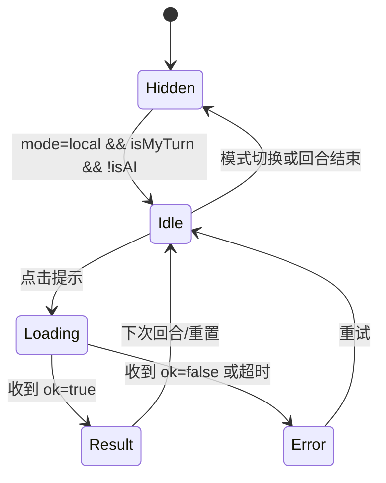

# 惯蛋教练 V1 详细设计方案（LLD）

## 1. 文档范围
本详细设计仅覆盖 V1 里程碑能力：
- `mode=local` 本地人机对战可用
- 玩家回合支持“教练提示”
- 返回“推荐出牌 + 策略理由”
- LLM 失败时规则模板兜底

不包含：
- 复盘回溯（V2）
- 人人对战教练（V3）

关联文档：
- `guandan/PRD-guandan-coach-v1.md`
- `guandan/HLD-guandan-coach-v1.md`

## 2. 代码改动清单（目标文件）

### 2.1 后端（server）
1. `server/src/socket/index.ts`
- 新增事件处理：`request-coach-hint`
- 新增响应事件：`coach-hint`
- 增加模式/轮次/身份校验

2. `server/src/coach/types.ts`（新增）
- 教练请求、响应、错误码类型定义

3. `server/src/coach/coach-hint-service.ts`（新增）
- `buildCoachHint()` 主服务
- 推荐牌生成、理由生成、兜底整合

4. `server/src/coach/reason-engine.ts`（新增）
- LLM 理由生成 + fallback 规则文案

5. `server/src/coach/prompt-builder.ts`（新增）
- 生成统一 prompt（已知信息约束）

6. `server/src/coach/fallback-reason.ts`（新增）
- 按 `play/pass` 与上下文生成规则解释

### 2.2 前端（client）
1. `client/src/types/index.ts`
- 新增 `CoachHintPayload`、`CoachHintState` 类型

2. `client/src/stores/game.ts`
- 新增 coach 状态字段与方法：
  - `coachHintState`
  - `setCoachHintLoading()`
  - `setCoachHintResult()`
  - `setCoachHintError()`
  - `resetCoachHint()`

3. `client/src/composables/useSocket.ts`
- 发送 `request-coach-hint`
- 监听 `coach-hint` 并写入 store

4. `client/src/components/Game/CoachHintPanel.vue`（新增）
- 按钮、加载态、结果展示、错误展示

5. `client/src/views/GameView.vue`
- 引入 `CoachHintPanel`
- 仅 `mode=local` + `isMyTurn` + `!myPlayer.isAI` 显示入口

## 3. 详细接口设计（Socket）

## 3.1 请求：`request-coach-hint`
方向：Client -> Server

```json
{
  "roomId": "LOCAL",
  "requestId": "uuid-xxxx"
}
```

字段说明：
- `roomId`：当前房间 ID
- `requestId`：客户端生成，用于并发请求匹配

## 3.2 响应：`coach-hint`
方向：Server -> Client（只回发给请求方 socket）

成功：
```json
{
  "ok": true,
  "roomId": "LOCAL",
  "requestId": "uuid-xxxx",
  "recommended": {
    "action": "play",
    "cards": ["spades_7_12", "hearts_7_19"],
    "patternType": "pair"
  },
  "reason": "上家牌型主值较低，用对子压制可稳住节奏，同时保留高价值牌型。",
  "confidence": "medium"
}
```

失败：
```json
{
  "ok": false,
  "roomId": "LOCAL",
  "requestId": "uuid-xxxx",
  "errorCode": "COACH_NOT_AVAILABLE_MODE",
  "errorMessage": "当前模式不支持教练提示"
}
```

## 3.3 错误码设计
- `COACH_NOT_AVAILABLE_MODE`：非 local 模式
- `COACH_NOT_YOUR_TURN`：未轮到请求者出牌
- `COACH_REQUEST_PLAYER_IS_AI`：请求者是 AI
- `COACH_ROOM_NOT_FOUND`：房间不存在
- `COACH_INTERNAL_ERROR`：内部异常（此时建议返回 fallback）

## 4. 服务端详细流程

```mermaid
flowchart TD
  A[收到 request-coach-hint] --> B{room存在?}
  B -- 否 --> E1[返回 COACH_ROOM_NOT_FOUND]
  B -- 是 --> C[读取 gameState]
  C --> D{mode=local?}
  D -- 否 --> E2[返回 COACH_NOT_AVAILABLE_MODE]
  D -- 是 --> F{当前socket对应玩家且轮到其出牌?}
  F -- 否 --> E3[返回 COACH_NOT_YOUR_TURN]
  F -- 是 --> G{玩家是AI?}
  G -- 是 --> E4[返回 COACH_REQUEST_PLAYER_IS_AI]
  G -- 否 --> H[BasicAI.selectCards(hand,lastPattern)]
  H --> I[normalize recommended play/pass]
  I --> J[ReasonEngine.generateReason]
  J --> K{LLM成功?}
  K -- 否 --> L[fallback reason]
  K -- 是 --> M[LLM reason]
  L --> N[组装 coach-hint(ok=true)]
  M --> N
  N --> O[emit 给请求socket]
```

## 4.1 `CoachHintService.buildCoachHint()` 伪代码
```ts
async function buildCoachHint(input: BuildCoachHintInput): Promise<CoachHintResult> {
  const recommendedCards = basicAI.selectCards(input.handCards, input.lastPlayedPattern);

  const normalized = normalizeRecommended(recommendedCards);
  // normalized: { action, cards, patternType }

  // 一致性校验（必须在当前手牌内）
  const legal = validateRecommendedInHand(normalized.cards, input.handCards);
  const finalRec = legal ? normalized : buildPassRecommendation();

  try {
    const reason = await reasonEngine.generateReason({
      recommended: finalRec,
      handCards: input.handCards,
      lastPlayedPattern: input.lastPlayedPattern,
      playedHistory: input.playedHistory
    });
    return { recommended: finalRec, reason: reason.text, confidence: reason.confidence };
  } catch {
    const fallback = buildFallbackReason(finalRec, input.lastPlayedPattern, input.handCards);
    return { recommended: finalRec, reason: fallback, confidence: "low" };
  }
}
```

## 4.2 `ReasonEngine` 约束
1. prompt 必须声明“只基于已知信息”。
2. 禁止输出“对手一定有 xx”。
3. 输出失败（解析失败、空字符串、超时）统一 fallback。

## 5. 前端详细设计

## 5.1 `CoachHintPanel` 组件状态机


## 5.2 `GameView` 展示条件
- `showCoachHintPanel = mode === 'local' && isMyTurn && myPlayer && !myPlayer.isAI`

## 5.3 Store 字段
```ts
interface CoachHintState {
  loading: boolean;
  requestId: string | null;
  recommended: {
    action: 'play' | 'pass';
    cards: string[];
    patternType: string | null;
  } | null;
  reason: string | null;
  confidence: 'low' | 'medium' | 'high' | null;
  errorCode: string | null;
  errorMessage: string | null;
}
```

## 5.4 前端并发保护
1. loading 期间按钮禁用。
2. 收到响应时检查 `payload.requestId === coachHintState.requestId`，不匹配则丢弃。

## 6. 文案与兜底模板

## 6.1 fallback 文案（play）
- `建议使用该牌型压制当前回合，优先保证本轮节奏，同时避免过早消耗高价值牌。`

## 6.2 fallback 文案（pass）
- `当前手牌不适合高成本压制，建议选择不出，保留关键牌型等待更优时机。`

## 7. 配置与开关
1. `COACH_HINT_ENABLED=true|false`（默认 true）
2. `COACH_REASON_TIMEOUT_MS`（默认 3000）
3. `COACH_USE_LLM=true|false`（默认 true；false 时总是 fallback）

## 8. 测试详细方案

## 8.1 后端单元测试
1. `buildCoachHint_play_success`
2. `buildCoachHint_pass_success`
3. `buildCoachHint_llm_timeout_fallback`
4. `buildCoachHint_invalid_recommended_to_pass`

## 8.2 Socket 集成测试
1. local 模式成功返回
2. online 模式返回 `COACH_NOT_AVAILABLE_MODE`
3. 非当前玩家请求返回 `COACH_NOT_YOUR_TURN`
4. AI 玩家请求返回 `COACH_REQUEST_PLAYER_IS_AI`

## 8.3 前端组件测试
1. 展示条件正确（local + my turn + human）
2. 点击后 loading -> result
3. 错误态展示与重试
4. requestId 乱序响应处理

## 9. 发布与回滚策略
1. 灰度开关：先仅在开发/测试环境开启。
2. 线上问题回滚：
   - 关闭 `COACH_HINT_ENABLED`，不影响主对局流程。
3. 监控：
   - 请求量、成功率、fallback 比率、P95 耗时。

## 10. 任务拆分建议（研发执行）
1. 后端（2~3 人日）
   - socket 事件 + service + reason engine + tests
2. 前端（2~3 人日）
   - panel 组件 + store + socket + tests
3. 联调（1 人日）
   - 字段对齐、错误码处理、文案确认

