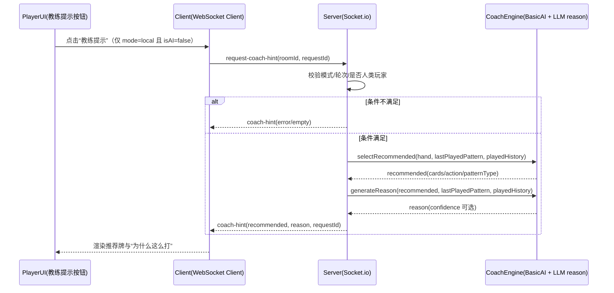
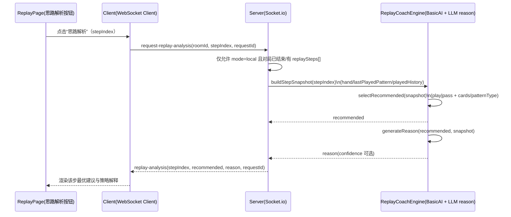
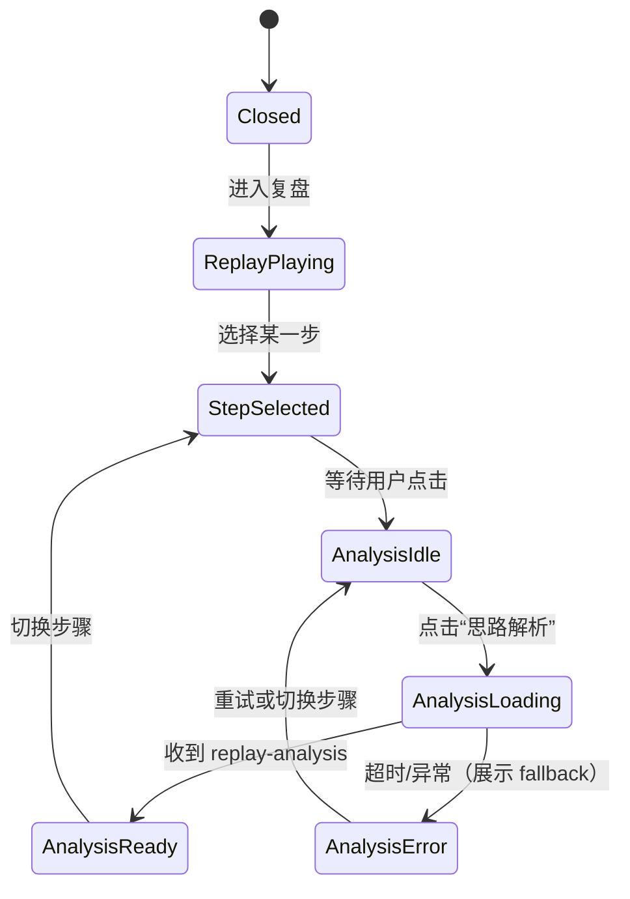

# 惯蛋教练（Guandan Coach）PRD v1

## 1. 背景
`guandan/` 现有系统已经实现了惯蛋牌局的基础玩法与 AI 对手出牌能力：
- 服务器端存在 `BasicAI`（以及可选的 `LLMController`）用于“选牌”。
- Socket 通信已覆盖：`play-cards` / `pass` / `cards-played` / `player-passed` / `round-end` 等事件。
- 客户端页面提供：手牌选择、出牌、不出、以及聊天窗口，但目前没有“出牌提示 + 为什么这么打”的教练能力。

本 PRD 旨在在不改变游戏输赢与判定规则的前提下，为玩家提供“建议怎么打”并同时解释“为什么这么打”的教学型提示，并聚焦支持人机对战（本地 PVE / `mode=local`）。

## 2. 目标（Goals）
1. 在玩家轮到出牌时，提供可理解的教练提示：
   - 给出建议牌（或建议“不出”）。
   - 同时给出“为什么这么打”的理由，理由结合当前局面信息进行推理。
2. 覆盖模式：
   - 人机对战（本方与 AI / `mode=local`）：提示用于提升人类玩家的理解与决策质量。
   - 人人对战（PVP）/在线房间（`mode=online`）：V1 不提供教练提示（按钮隐藏或禁用，服务端不响应教练请求）。
3. 推理理由符合约束：不能编造对手手牌等未知信息，只能基于“已知信息”做合理推断。

## 3. 非目标（Non-Goals）
1. 不改变惯蛋规则、牌型判定、出牌合法性校验（`judge/canBeat/analyzePattern` 等）。
2. 不保证“理由”必然导致必胜，仅保证理由可解释且与推理约束一致。
3. 不要求教练在 UI 上永久常驻；MVP 提供“按需请求”的提示即可。

## 4. 关键现状与代码约束（Code Evidence）
### 4.1 AI 选牌（推荐牌源）
- `BasicAI.selectCards(cards, lastPattern)`：给定当前可选手牌与上家出牌牌型（`lastPattern`）返回建议出牌集合；若策略选择“不出”，返回空数组 `[]`。
  - 位置：`guandan/server/src/ai/basic.ts`
  - 要点：当 `lastPattern === null` 时选择首出；当存在 `lastPattern` 时尝试寻找可压制牌，或根据 `shouldPass` 决定是否 pass。
- 服务器当前 AI 回合选择使用 `BasicAI`：
  - `guandan/server/src/socket/index.ts` 内 `handleAITurn()`：
    - `const ai = new BasicAI(room.game, room.aiDifficulty)`
    - `const cards = ai.selectCards(currentPlayer.cards, state.lastPlayedPattern)`
    - `cards.length > 0` 则 `room.game.playCards(...)`，否则 `room.game.pass(...)`

> 注：`LLMController`（`guandan/server/src/ai/llm.ts`）当前存在，但未在 `handleAITurn` 中被使用（当前 socket AI 流程调用的是 `BasicAI`）。教练功能可在 PRD 中定义：MVP 推荐牌仍复用 `BasicAI`；“理由”可在可配置时接入 LLM，失败则回退到规则解释。

### 4.2 游戏状态（理由输入上下文）
- 游戏状态结构在 `guandan/server/src/game/game.ts`：
  - `lastPlayedPattern`：上家牌型（用于判断能否压制）。
  - `playedCards`：每次出牌的历史记录，包含 `position/cards/pattern`。
- `GuandanGame.playCards()` 会更新：
  - `this.state.playedCards.push(...)`
  - `this.state.lastPlayedPattern = pattern`
  - `this.state.lastPlayerIndex = playerIndex`

### 4.3 客户端交互与 socket 订阅（UI 对接约束）
- 客户端通过 `guandan/client/src/composables/useSocket.ts` 订阅并更新状态：
  - `cards-played`、`player-passed`、`round-end`、`new-message` 等。
  - 目前没有教练相关的事件/请求。
- UI 层目前的出牌交互入口在 `guandan/client/src/views/GameView.vue`：
  - `game-controls` 区域包含“出牌”和“不出”两个按钮，并通过 `GameBoard` 分发 `selectedCards` 与出牌/不出触发。
- 手牌点击选择由 `guandan/client/src/components/Game/HandCards.vue` 控制：
  - `HandCards` 在 `selectable` 为真时才允许点击选牌，并通过 `select` 事件回传。
- 另外，客户端本地类型 `guandan/client/src/types/index.ts` 对 `GameState.playedCards` 的字段定义为：
  - `playedCards: Map<PlayerPosition, CardPattern>`
  - 但服务器端 `guandan/server/src/game/game.ts` 内部状态为：
    - `playedCards: PlayedCards[]`

为避免“类型/序列化不一致”影响教练推理上下文，PRD 要求在教练提示的数据输入（请求给教练或 LLM 的上下文）中使用**显式的历史数组**（例如 `playedHistory[]`），而不依赖客户端 `Map` 的结构。
- 客户端 UI 组件（现状）：
  - 手牌选择：`guandan/client/src/components/Game/HandCards.vue`
  - 出牌按钮/不出按钮与 `GameBoard`：`guandan/client/src/views/GameView.vue` / `GameBoard.vue`
  - `HandCards` 通过 `selectable` 控制是否允许点击选择。

## 5. 用户与使用场景（User Stories）
### 5.1 人机对战（PVE）
- 作为玩家（玩家=非 AI），当轮到我出牌时：
  1. 我可以点击“教练提示”。
  2. 教练给出建议牌（可用于我选择手牌）。
  3. 同时解释“为什么这么打”，并且理由与当前局面一致。

### 5.2 人人对战（PVP）
- V1 默认不支持教练提示：在 `mode=online`/在线房间中隐藏或禁用“教练提示”入口，不发送教练请求，也不展示推荐与理由。

## 6. 功能需求（Functional Requirements）
### 6.1 教练提示触发
- 触发时机：仅当游戏处于本地人机对战（`mode=local`）且“轮到当前玩家出牌”时，并且当前出牌玩家为人类（`isAI=false`）时，启用教练提示请求按钮。
- 触发动作：仅在上述条件成立时，客户端发送 `requestCoachHint` 到服务端；否则入口隐藏或禁用，不发起教练请求。

### 6.2 教练输出内容（Coach Output）
教练提示输出必须包含以下字段：
1. `recommended`
   - `cards`: 建议出牌的牌列表（建议用“牌 id”而非牌面文本，便于前端直接对应当前手牌）
   - `patternType`: 建议牌型类型（例如 single/pair/straight/bomb/joker_bomb 等）
2. `reason`
   - 自然语言理由（中文优先），包含“要这么打”的关键原因点
   - 必须引用已知局面信息，不得编造未知信息（例如对手手牌）
3. `confidence`（可选）
   - 建议的置信程度或“策略性提示”标记
   - 例如：`high|medium|low` 或 `strategy_note`

### 6.3 理由生成约束（Reasoning Constraints）
理由生成必须遵循以下约束（强制）：
1. 已知信息来源（允许）：
   - 当前玩家手牌（本方可见）
   - 上家/当前有效牌型：`lastPlayedPattern`
   - 历史出牌：`playedCards`（其他人已打出的牌）
2. 禁止信息（不允许）：
   - 对手未出牌的手牌内容
   - 任何不可证明的“对手会/一定有某张牌”的断言
3. 允许的推断方式：
   - 基于 `canBeat` / 牌型主值比较给出“为什么能压制/为什么不该硬压”
   - 基于保留关键牌（例如炸弹/王）给出“为什么建议节省资源”的策略性理由
   - 基于回合节奏给出“为什么选择更稳/更激进”的策略理由（但不声称必然结果）

### 6.4 兜底策略（Fallback）
- 若 LLM 不可用或超时：
  - 返回规则解释型理由（模板化），并仍提供推荐牌（推荐牌仍来自 `BasicAI`）。
- 若推荐牌为空表示 pass：
  - reason 中必须解释“为什么选择不出”（例如：无法有效压制、保存牌型结构、等价保守策略）。

### 6.5 教练返回内容契约（Coach Contract）
教练提示的输出必须满足下列契约（便于前端解析与一致性校验）：
1. `recommended`
   - `action`: `play` 或 `pass`
   - `cards`：当 `action=play` 时为建议出牌的牌 id 数组；当 `action=pass` 时为空数组
   - `patternType`：建议牌型类型；当 `action=pass` 时为 `null`
   - 一致性校验：服务端必须保证 `recommended.cards` 只包含“请求时刻”当前玩家手牌里的卡 id；否则回退到兜底推荐（通常为 BasicAI 的结果）。
2. `reason`
   - 只允许引用：当前玩家手牌与 `lastPlayedPattern`/`playedCards`（已打牌历史）的信息
   - 不得包含任何关于“对手未出牌手里有什么”的确定性信息
   - 当 `action=pass` 时，必须解释“为什么选择不出/为什么不硬压”的策略原因
3. `confidence`（可选）
   - 用于 UI 标识：该建议更偏确定压制还是策略性选择（例如 high/medium/low）

示例（play）：
```json
{
  "recommended": {
    "action": "play",
    "cards": ["spades_7_12", "hearts_7_19"],
    "patternType": "pair"
  },
  "reason": "上家打的是单牌/对子（主值较小），我们用对子压制能有效赢墩；同时这手对子不是唯一关键牌型，因此选择出牌以保留后续连贯的出牌顺序。"
}
```

### 6.6 复盘功能（PVE Replay）
在人机对战（`mode=local`）中新增“复盘”能力，帮助玩家在对局结束后逐手学习。

#### 6.6.1 触发时机
- 仅在一局结束后（`status=round_end` 或 `game_over`）展示“进入复盘”入口。
- 仅在 `mode=local`（本地人机）启用；`mode=online` 不提供复盘与解析。

#### 6.6.2 复盘内容
- 从该局第 1 手开始，按时间顺序回放每个动作：
  - 玩家出牌（cards + pattern）
  - 玩家不出（pass）
  - 当前轮到谁
  - 当时上下文（`lastPlayedPattern`、已打历史片段）
- 用户可逐步控制：
  - 上一步 / 下一步
  - 自动播放（可选）
  - 跳转到指定手数（可选）

#### 6.6.3 思路解析（Replay AI Analysis）
- 在复盘每一步时，用户可点击“思路解析”按钮请求 AI。
- AI 返回“该步最优建议 + 策略解释”，并与该步快照严格对齐：
  - 最优建议：`recommended`（play/pass、cards、patternType）
  - 策略说明：为什么这一步这样打更优（基于当时信息）
  - 可选对比：为何不推荐另一常见打法（V2）
- 解析约束与实时教练一致：
  - 只基于“该步当时可见信息”（手牌、lastPlayedPattern、已打牌历史）
  - 不编造对手未出牌手牌信息

#### 6.6.4 复盘数据模型（最小要求）
- 每局结束后持有一份 `replaySteps[]`（内存即可，V1 不强制持久化）：
  - `stepIndex`
  - `actorId` / `actorName` / `isAI`
  - `action` (`play|pass`)
  - `cards`（若 play）
  - `pattern`（若 play）
  - `snapshot`：
    - `currentPlayerIndex`
    - `lastPlayedPattern`
    - `playedHistory`（到该步为止）
    - `handCardsOfActor`（当步执行前）

## 6.7 复盘解析接口契约（Replay Analysis Contract）
在不影响实时对局事件的前提下，新增复盘解析请求/响应（仅 PVE local）：

1. 客户端请求：`request-replay-analysis`
- 字段：
  - `roomId`
  - `requestId`
  - `stepIndex`

2. 服务端响应：`replay-analysis`
- 字段：
  - `roomId`
  - `requestId`
  - `stepIndex`
  - `recommended`（play/pass + cards + patternType）
  - `reason`
  - `confidence`（可选）

约束：
- 仅在 `mode=local` 可用；`mode=online` 直接拒绝或返回不支持。
- 若 LLM 超时/失败，返回规则兜底解释 + 推荐。

示例（pass）：
```json
{
  "recommended": {
    "action": "pass",
    "cards": [],
    "patternType": null
  },
  "reason": "无法用当前牌型稳定压制或压制成本过高。选择不出以保留炸弹/王等高价值牌型，等待更有利的节奏。"
}
```

## 7. LLM 与 Prompt 设计（LLM Design）
### 7.1 使用场景
- 推荐牌（`recommended.cards`）建议先复用 `BasicAI` 的 `selectCards` 行为（稳定、可控）。
- LLM 的角色主要用于生成 `reason` 文本（可配置接入）。

### 7.2 Prompt 输入字段（必须）
- `handCards`: 当前玩家手牌（卡片 id/rank/suit 或仅保留 rank+value，按实现精简）
- `lastPattern`: 上家牌型类型与主值（`type/mainValue`）
- `playedHistory`: `playedCards` 数组（位置、牌型类型、主值、牌面可选）
- `recommended`: 建议出牌（cards + patternType），用于解释一致性

### 7.3 Prompt 约束（必须写入 prompt）
- 明确：理由必须基于输入数据推理；不得编造未知对手手牌。
- 明确：若推荐为 pass，则理由必须解释“为什么不出”。
- 输出要求：JSON + reason 字段，便于前端渲染。

## 8. 接口/事件设计（Socket Contract）
### 8.1 为什么使用 Socket
- 当前系统使用 Socket.io 进行实时对战状态同步（`guandan/server/src/socket/index.ts`）。
- 教练提示是实时交互（请求/响应），适合通过 Socket 事件实现。

### 8.2 新增事件定义
1. 客户端请求：`requestCoachHint`（Socket.io 事件名建议：`request-coach-hint`）
   - 请求字段（建议）：
     - `roomId`: 房间号
   - 由服务端根据 `socket.id` 推断请求者身份并定位玩家，不必由客户端信任传入的 `playerId`（减少作弊面）。
   - 建议附带：
     - `requestId`: 客户端生成的随机字符串，用于前端并发请求匹配。
   - 可选字段（仅供 UI 标识/排查，不作为推理依据）：
     - `playerId`: 客户端本地已知玩家 id（建议为空或传当前 socket 对应 id）
     - `stateSnapshot`: 客户端当前观察到的 `gameState`（不可信；服务端以 `room.game.getState()` 为准）


2. 服务端响应：`coachHint`（Socket.io 事件名建议：`coach-hint`）
   - 返回字段（必须）：
     - `roomId`
     - `requestId`（与请求保持一致）
     - `recommended`
       - `action`: `play|pass`
       - `cards`: 建议出牌的牌 id 数组（当 action=pass 时为空数组）
       - `patternType`: 建议牌型类型（当 action=pass 时为 `null`）
     - `reason`
       - 自然语言理由（中文优先）
    
     - `confidence`（可选）
   - 发送策略：
     - 仅用于本地人机对战（`mode=local` / PVE）。
     - PVP/在线房间（`mode=online`）不触发教练提示；服务端可以直接拒绝请求或返回空/错误，前端不展示 coachHint。

3. 复盘解析请求：`request-replay-analysis`
   - 仅用于 `mode=local` 且对局结束后的复盘页面。
   - 请求字段：`roomId`、`requestId`、`stepIndex`

4. 复盘解析响应：`replay-analysis`
   - 返回字段：`roomId`、`requestId`、`stepIndex`、`recommended`、`reason`、`confidence`（可选）
   - 若该步不支持解析或异常，返回错误码并提示 fallback 解析文案。

### 8.3 超时/失败
- 超时（例如 3-8s，按实现）：
  - 返回规则兜底理由与 BasicAI 推荐牌。
- LLM 失败：
  - 仍返回推荐牌 + fallback reason。

### 8.4 事件与现有事件的关系
- `cards-played` / `player-passed` / `round-end` 保持原样。
- `coachHint` 是“提示请求/返回”，不改变已存在对局流程。

## 8.5 UML 设计（Coach Hint & Replay Analysis）

### 8.5.1 时序图：人机对战出牌提示（Coach Hint）


### 8.5.2 时序图：复盘逐步“思路解析”（Replay Analysis）


### 8.5.3 状态机：复盘页面 UI 状态（简化）


## 9. 前端展示方案（UI Requirements）
### 9.1 展示位置
- 推荐在 `GameBoard/HandCards` 附近新增一个“教练提示面板”，包含：
  1. 按钮：`教练提示`
  2. 加载态：提示生成中...
  3. 推荐牌展示：
     - 允许高亮当前手牌中与推荐牌 id 对应的牌（提升可理解性）
     - 或显示牌型摘要（更轻量）
  4. `reason` 文本展示：可折叠/可复制

### 9.2 交互策略
- 点击“教练提示”后：
  - 禁用按钮（避免连点多次请求）
  - 展示加载态
  - 成功后显示推荐牌与理由
- 与现有 `HandCards selectable` 的关系：
  - 教练建议不直接自动出牌；只影响推荐展示与高亮，保持玩家可控性。

### 9.3 模式限制：仅本地人机对战展示
- 当路由/房间模式为 `mode=local`（本地人机对战 / PVE）时：
  - 展示“教练提示”入口与推荐牌/理由面板。
- 当路由模式为 `mode=online`（在线房间 / PVP）时：
  - V1 不展示“教练提示”入口（或展示但禁用）。
  - 前端不发起 `requestCoachHint`，也不展示 `coachHint` 的推荐牌与理由。

### 9.4 复盘页面与交互（V2 规划）
- 对局结束后，在结果区新增“复盘本局”按钮（仅 `mode=local`）。
- 复盘页核心区块：
  1. 步骤时间轴（step 1...N）
  2. 牌桌状态回放区（该步出牌/不出、当前轮次）
  3. “思路解析”按钮
  4. 解析面板（recommended + reason）
- 用户在任意步骤点击“思路解析”后：
  - 进入加载态
  - 收到 `replay-analysis` 后渲染结果
  - 失败时展示兜底文案（并可重试）

## 10. 验收标准（Acceptance Criteria）
1. 当轮到当前玩家出牌时，点击“教练提示”：
   - 必须返回推荐牌（可为空表示 pass）与理由文本。
2. 理由必须符合约束：
   - 不包含对手未出牌手牌的确定性信息。
   - 对于 pass 的原因解释必须出现。
3. PVP/online：
   - 教练提示入口不可用或不触发；
   - 界面不展示 `coachHint`（不返回推荐牌与理由）。
4. 错误/超时：
   - LLM 失败不会阻断游戏，必须提供 fallback reason。
5. UI：
   - 推荐牌与理由在界面可见、可读、不会影响出牌按钮的基础功能。
6. 复盘（仅 PVE local，V2 验收）：
   - 对局结束后可进入复盘并逐步回看所有动作。
   - 任一步点击“思路解析”都可返回该步的最优建议与策略说明（或 fallback）。
   - 复盘解析不影响实时对局逻辑与结果状态。

## 11. 里程碑（Milestones）
### V1：人机惯蛋 + 惯蛋教练（PVE local）
- 目标：
  - 完整可玩的本地人机对战（`mode=local`）。
  - 玩家回合可调用“教练提示”，获得推荐牌 + 理由。
- 范围：
  - 推荐牌：复用 `BasicAI.selectCards`。
  - 理由：LLM 生成，失败时规则模板兜底。
  - 模式限制：`mode=online` 不展示教练提示入口。
- 交付标准：
  - 教练提示可稳定返回 `recommended + reason`；
  - 不影响既有出牌/不出主流程。

### V2：复盘回溯 + 单步思路解析（PVE local）
- 目标：
  - 一局结束后可从头回看每个出牌步骤。
  - 回看任一步时可点击“思路解析”，获得该步最优建议与策略说明。
- 范围：
  - 新增 `replaySteps[]` 数据结构与复盘页面；
  - 新增 `request-replay-analysis` / `replay-analysis` 事件；
  - 失败兜底：规则模板解释。
- 交付标准：
  - 可逐步回放 + 指定步解析；
  - 解析结果与对应 `stepIndex` 快照一致。

### V3：人人对战（PVP online）
- 目标：
  - 上线在线房间的人人对战（`mode=online`）完整玩法与稳定同步。
- 范围：
  - 房间创建/加入、状态同步、断线重连、对局结算完善；
  - 教练能力默认关闭（可后续按产品策略评估是否开放独立模式）。
- 交付标准：
  - 在线对战稳定可用；
  - 不因教练/复盘模块引入在线对战信息泄露风险。

### 后续增强（V4+）
- 教练解释增强：多方案对比（最佳/次优/高风险）与整局总结。
- 训练化能力：错招识别、个性化提升建议、局后学习报告。

## 12. 备注与风险
1. LLM 成本与延迟：
   - 建议做缓存（同一局面同一推荐在短期内复用）。
2. 理由一致性：
   - 若 LLM 输出与推荐牌不一致，应在服务端做校验（例如检查推荐牌 id 是否存在于手牌中）。
3. 安全性：
   - 教练提示仅在 PVE local 使用，避免在在线/PVP 场景泄露额外推理信息。

## 13. 拓展功能预留（Future Extensions）
以下能力作为后续版本预留，不纳入 V1/V2/V3 的必交范围：

1. 话术教练（Table Talk Coach）
- 能力描述：
  - 根据当前场面（领先/落后、回合关键节点、队友状态）生成不同风格话术建议，用于干扰对手或稳定队友心态。
- 预留要求：
  - 话术模板库 + LLM 动态生成双通道；
  - 支持“克制/中性/激进”风格档位；
  - 支持一键发送或仅建议不发送。

2. 身份识别策略（Identity-aware Strategy）
- 能力描述：
  - 当系统识别到特定关系身份（例如队友/对手是老板）时，可切换策略与话术偏好（例如“让老板赢得漂亮、赢得开心”的策略模式）。
- 预留要求：
  - 关系身份数据需用户主动配置与授权，不做隐式推断；
  - 增加“策略偏好开关”（标准竞技 / 关系优先）；
  - 全链路可解释：给出“为何采取该策略”的说明，避免黑箱决策。

3. 扩展边界说明
- 所有“话术/身份”能力必须可关闭，默认关闭；
- 应提供合规与公平性配置项（例如比赛模式禁用、休闲模式可选）；
- 不影响核心规则判定与对局可用性。

